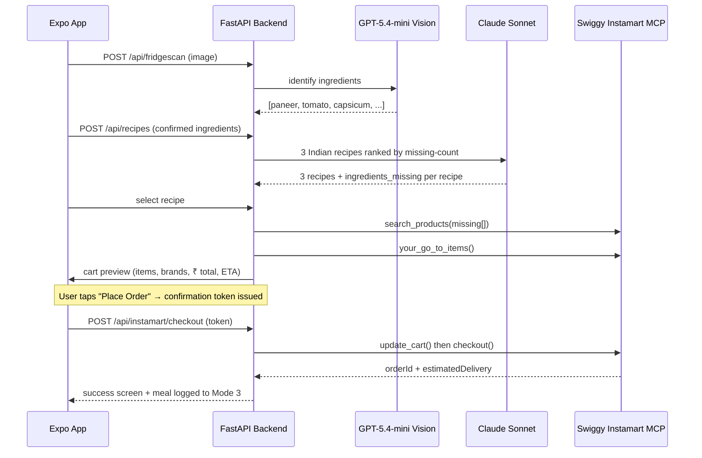
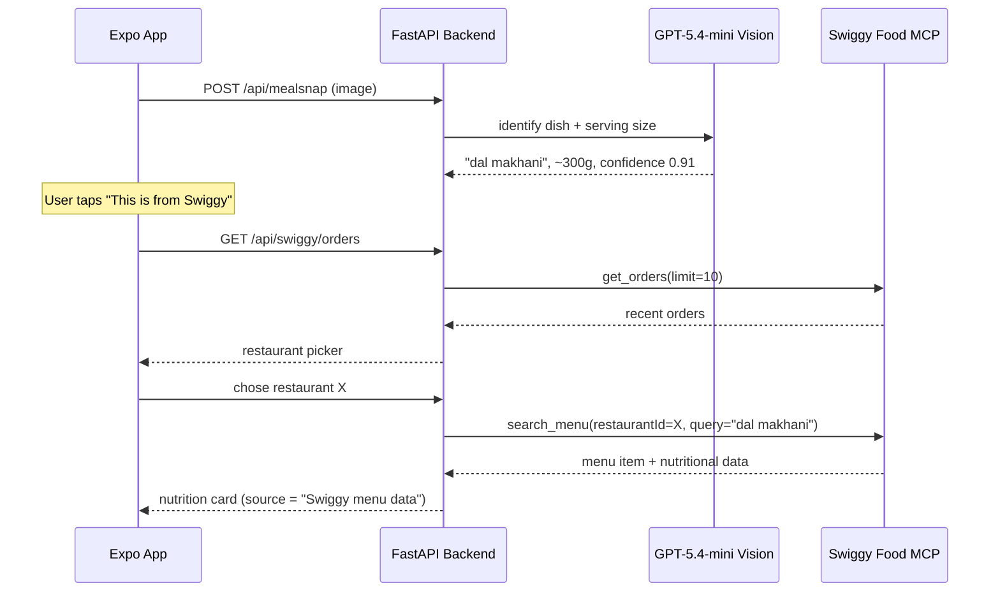
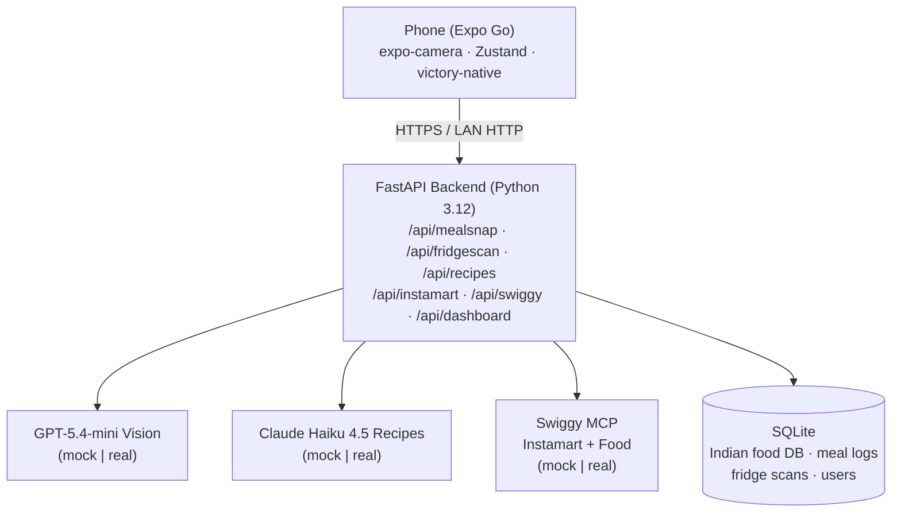

# SnapCal

> **Snap your fridge. Get recipes. Know your nutrition.**

   

**SnapCal is a camera-first food intelligence app for Indian consumers, built on Swiggy's Instamart and Food MCPs.** Snap your fridge to get Indian recipe suggestions and auto-order missing ingredients from Swiggy Instamart. Snap any meal to instantly get India-accurate nutrition data. One camera, three modes, everything food.

> _Hero GIF / demo video lands here in Phase 11. Until then, see [`submission/demo-script.md`](submission/demo-script.md) for the 60–90s storyboard._

---

## The 60-second read (for Swiggy reviewers)

Hi — thanks for reading. If you're reviewing this for the [Swiggy Builders Club](https://mcp.swiggy.com/builders/), here's what you need to know in the next minute:

**Who:** Oltaflock — building consumer products for urban Indian users. Contact: `amaan@oltaflock.ai`.

**What we're building:** SnapCal is a native mobile app (Expo + React Native) that uses GPT-5.4-mini vision and Claude Haiku 4.5 to turn the phone camera into a food intelligence layer for Indian users. It sits between the user's kitchen and Swiggy's commerce infrastructure.

**Why we're applying:** SnapCal is structurally dependent on Swiggy. Mode 1 (FridgeScan → order missing ingredients) is only viable on Instamart's 10-minute logistics network across 131 Indian cities. Mode 2's standout feature — grounding Indian nutrition estimates in real restaurant menu data — only works against the Swiggy Food MCP's `search_menu` because that's where India's restaurant menus actually live.

**The two sections that matter most to you:**
1. [Why we need the Swiggy MCP](#why-we-need-the-swiggy-mcp) — exact tool calls and what each enables.
2. [What this does for Swiggy](#what-this-does-for-swiggy) — the business case for approving us.

**Current status:** Demo is being built on localhost (Swiggy explicitly allows `http://localhost` as a redirect URI for dev). The entire mock layer means the app runs end-to-end with no real API keys. The moment we get Builders Club credentials, a single config flip points us at the real MCP.

---

## The problem we're solving

Three problems no single app solves today:

1. **The daily "what do I cook?" paralysis.** Every Indian household opens the fridge, stares for 30 seconds, and either repeats yesterday's meal or orders Swiggy. No app looks at what you already have and tells you what you can cook _right now_.
2. **Indian food has no accurate nutrition layer.** Cal AI works for Western food. It fails for poha, sabudana khichdi, dal makhani, biryani. Indian users tracking calories use Western-biased databases that give wrong numbers, or they give up.
3. **The last-mile ingredient gap.** When someone decides to cook a specific meal, the most common blocker is one or two missing ingredients. No app connects "what I want to cook" to "order exactly what I'm missing" in one frictionless flow.

SnapCal fills the gap between the kitchen, nutrition tracking, and Swiggy's commerce infrastructure.

---

## What SnapCal is — three modes, one camera

| Mode | Entry | What it does |
|---|---|---|
| **1 — FridgeScan** | Toggle: Fridge | Snap fridge interior → GPT-5.4-mini detects ingredients → Claude Haiku 4.5 returns 3 Indian recipes ranked by fewest missing ingredients → tap a recipe → Instamart cart auto-built for missing items → confirmation screen → `checkout` |
| **2 — Meal Snap** | Toggle: Meal (default) | Snap any meal → Vision AI identifies the Indian dish + serving size → India-accurate calories + macros from our internal Indian Food DB (or `search_menu` cross-reference if it's a Swiggy order) → "Log this meal" |
| **3 — Today** | Today tab | Daily calorie ring + protein/carbs/fat rings + chronological meal log, all auto-populated from Modes 1 and 2. No manual entry anywhere. |

---

## Why we need the Swiggy MCP

**TL;DR:** SnapCal is structurally impossible without Swiggy.
Instamart is the only service that can deliver the _exact_ missing ingredient for a recipe in under 30 minutes across 131 Indian cities. The Swiggy Food MCP is the only place where India's restaurant menu data lives — which makes it the only realistic grounding source for accurate Indian nutrition data when a user snaps a delivery meal.

### Swiggy Instamart MCP — powers Mode 1 (FridgeScan → order)

| Tool | How SnapCal uses it | Why no other API works |
|---|---|---|
| `search_products` | For each missing ingredient (e.g. "capsicum", "coriander", "paneer"), find a real purchasable SKU near the user's address | No competing 10-minute grocery service in India matches Instamart's depth across regional brands and FMCG breadth |
| `your_go_to_items` | Prefer brands the user already buys (Amul vs Mother Dairy paneer, Aashirvaad vs Pillsbury atta, Tata vs Catch salt) | Real personalisation requires the user's _actual_ Instamart purchase history — only Swiggy has this |
| `update_cart` | Build a real Instamart cart with quantities, prices in ₹, ETA | Swiggy-native cart means Swiggy-native checkout — no parallel payments stack to rebuild |
| `checkout` | Place the order — only after explicit user "Place Order" tap with a server-issued confirmation token | Final fulfilment runs on Swiggy's logistics network; SnapCal never touches money or delivery routing |

### Swiggy Food MCP — powers Mode 2's novel nutrition cross-reference

| Tool | How SnapCal uses it | Why this is novel |
|---|---|---|
| `get_orders` | When a user snaps a meal that came from Swiggy, surface their recent orders so they can pick the right one | Links a photo to the _exact_ dish that was ordered |
| `search_menu` | Fetch the listed menu item (and any nutrition info Swiggy publishes) for the dish in question | **First nutrition app to ground Indian dish estimates in real Swiggy restaurant menu data** instead of generic Western databases (Cal AI, MyFitnessPal). This is the standout API use we're applying with. |

### MCP call sequence — Mode 1 (FridgeScan)



### MCP call sequence — Mode 2 (Swiggy order detection)



Both sequences mirror PRD §8 exactly.

---

## What this does for Swiggy

- **Incremental Instamart orders.** Every FridgeScan session is an order Swiggy would not have captured otherwise — the user wasn't going to open Instamart, they were going to repeat yesterday's meal or order delivery. SnapCal converts a "what do I cook?" moment into a basket of fresh ingredients.
- **New entry point to Swiggy's target demographic.** SnapCal reaches urban, 22–35, health-aware Indians via a _daily nutrition habit_ (Mode 2) that has nothing to do with delivery. That daily engagement then converts to occasional ordering on the user's own initiative.
- **Aligned data asset.** The Indian Food Database we're building (with `cooking_method_variance` flagging — a field that doesn't exist in any Western nutrition DB) plus our `search_menu` cross-reference signals create a dataset of "what dishes Indian users are photographing" — implicit demand signal aligned with Swiggy's catalog.
- **Co-branding on a polished product.** Every screen that surfaces Swiggy data carries the "Powered by Swiggy" badge per brand guidelines.

---

## Architecture



**Why this stack:** Expo gives full native camera hardware access via `expo-camera` (browser `getUserMedia` cannot match it) and lets the demo run on a real phone in under 2 minutes via Expo Go. FastAPI is the most ergonomic Python framework for async LLM orchestration. GPT-5.4-mini gives strong vision quality on cluttered fridge interiors and complex Indian thalis at ~6× lower input cost than the legacy GPT-4o we initially scoped against. Claude Haiku 4.5 is best-in-class price/performance for structured JSON output and has strong Indian cuisine knowledge in our internal evals. Full rationale in [`docs/snapcal-prd.md`](docs/snapcal-prd.md) §7.

See [`docs/architecture.md`](docs/architecture.md) for the deep version.

---

## Security & guardrails

These are not UI niceties — they are **enforced in the backend code**. The form asks about "security setup"; here's ours:

- **No secrets in the repo.** Everything via environment variables; `.env.example` shows the shape, `.env` is gitignored.
- **Swiggy OAuth flow:** access tokens never seen by the React Native client. Tokens stored server-side, refreshed automatically. Registered redirect URI: `http://localhost:8000/api/swiggy/callback` (demo) and `https://snapcal.app/api/swiggy/callback` (production-reserved).
- **Hard guardrail — explicit checkout confirmation.** `checkout()` is _structurally impossible_ without a server-issued single-use confirmation token. The token is only issued by `POST /api/instamart/confirm` in response to an explicit "Place Order" tap on the confirmation screen. Auto-checkout cannot occur.
- **Hard guardrail — ₹1000 cart cap.** Enforced as a `CartCapExceeded` exception in `GapAnalyzer` before `update_cart` is called. Configurable via `CART_CAP_INR`.
- **COD warning surfaced.** Cash-on-delivery orders trip a backend flag that the UI must acknowledge before checkout proceeds.
- **Fridge photos are discarded** after Vision AI processing — never persisted. Meal photos are opt-in only.
- **Rate limit:** 50 snaps/user/day (`DAILY_SNAP_LIMIT`) to prevent Vision AI abuse.
- **Failure-mode handling:** `SwiggyRealClient` is a stub raising `NotImplementedError("Pending Builders Club credentials")` — visible in the codebase, so the swap-to-real path is obvious to reviewers.

See [`SECURITY.md`](SECURITY.md) (added in Phase 11).

---

## Tech stack

| Layer | Technology | Purpose |
|---|---|---|
| Mobile app | Expo SDK + React Native + TypeScript | Native iOS + Android, full camera hardware access |
| Demo runner | Expo Go | Scan QR, app runs on a real phone, no App Store needed |
| Backend | FastAPI (Python 3.12) + Uvicorn | API server, AI orchestration, Swiggy MCP calls |
| Demo hosting | localhost | Swiggy explicitly allows `http://localhost` for dev |
| Production hosting | Vercel (post-approval) | FastAPI serverless |
| Database (demo) | SQLite | Zero-setup, swap-ready to Supabase |
| Database (prod) | Supabase | PostgreSQL + Auth + Storage |
| Vision (primary) | GPT-5.4-mini | Strong accuracy on cluttered fridges + complex thalis at ~6× lower input cost than GPT-4o |
| Vision (fallback) | Gemini 2.0 Flash | 10× cheaper, post-launch cost optimisation |
| Recipes | Claude Haiku 4.5 | Near-frontier structured JSON + Indian cuisine knowledge at Haiku price ($1 / $5 per 1M tok) |
| Nutrition | Claude Haiku 4.5 | Estimation for dishes outside the internal DB |

---

## Run the demo in 2 minutes

The entire app runs end-to-end on localhost. `USE_MOCKS=true` means no API keys required.

```bash
# 1. Clone and configure
git clone https://github.com/AmaanBarmare/snapcal.git
cd snapcal
cp .env.example .env   # default values are demo-ready; USE_MOCKS=true

# 2. Backend — terminal 1
cd backend
python3 -m venv .venv && source .venv/bin/activate
pip install -r requirements.txt
uvicorn app.main:app --reload --host 0.0.0.0 --port 8000
# verify: curl http://localhost:8000/api/health  → {"status":"ok","mocks":true,...}

# 3. Expo app — terminal 2
cd app
npm install
# point the phone at your laptop's LAN IP (e.g. en0)
EXPO_PUBLIC_API_URL="http://$(ipconfig getifaddr en0):8000" npx expo start
# Scan the QR with Expo Go (same WiFi as the laptop)
```

Then on the phone: allow camera → tap **Fridge** → snap → tap **Find recipes** → pick a recipe → review the Instamart cart → tap **Place Order**. Switch to **Today** tab to see your planned meal.

**Run the test suite:**

```bash
cd backend && source .venv/bin/activate && pytest -q
# 30 tests, all green
```

**Run the type checker on the app:**

```bash
cd app && npx tsc --noEmit
```

---

## Project status

| | |
|---|---|
| Builders Club application | Draft answers ready in [`submission/application-answers.md`](submission/application-answers.md); awaiting demo video before submission |
| Demo build | **Complete end-to-end on localhost** — both modes, full dashboard, guardrailed checkout |
| Backend test coverage | 30/30 pytest tests passing |
| Frontend type check | clean (`tsc --noEmit`) |
| Mock layer | Vision · Recipes · Swiggy MCP — all behind one-interface adapters |
| Production deployment | Post-approval (Vercel + Supabase) |

---

## Roadmap (MVP → V1.1 → V2)

- **MVP (this build):** Modes 1, 2, 3 working end-to-end on localhost with mocks; top-100 Indian Food DB; reviewer-ready repo + demo video.
- **V1 (post-approval):** Real Swiggy MCP wired in; Supabase swap; deployed to Vercel; full 200-dish DB; Google OAuth login.
- **V1.1:** Weekly history view; serving size adjustment; offline mode; AI-generated insights.
- **V2:** Family profiles; dietary restriction filters; voice mode; Swiggy Food restaurant ordering integration.

Full scope breakdown in [`docs/snapcal-prd.md`](docs/snapcal-prd.md) §12.

---

## Repo structure

```
snapcal/
├── backend/            FastAPI + Python services + mock/real adapters
├── app/                Expo (React Native, TypeScript)
├── docs/
│   ├── snapcal-prd.md  Full PRD (40+ pages of product thinking)
│   └── architecture.md Architecture deep-dive + MCP call sequences
├── submission/
│   ├── application-answers.md  Pre-filled Builders Club form answers
│   ├── cover-email.md          Email draft to builders@swiggy.in
│   └── demo-script.md          60–90s storyboard
├── .env.example        All keys you'll ever need, with defaults
└── README.md           ← you are here
```

---

## About the team

**Oltaflock** — building consumer products for urban Indian users.
**Lead:** Amaan Barmare · `amaan@oltaflock.ai`
**Co-author of this PRD:** Khush · `khush@oltaflock.ai`

---

## Acknowledgements

**Powered by Swiggy.** SnapCal is built for and intended to integrate with the [Swiggy Builders Club](https://mcp.swiggy.com/builders/) program. Brand assets used per Swiggy's co-branding guidelines.

---

## Useful links

- [PRD (full)](docs/snapcal-prd.md)
- [Architecture deep-dive](docs/architecture.md)
- [Submission package](submission/)
- [Builders Club program](https://mcp.swiggy.com/builders/)
- [Apply / contact builders@swiggy.in](mailto:builders@swiggy.in)
