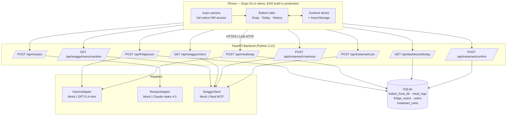
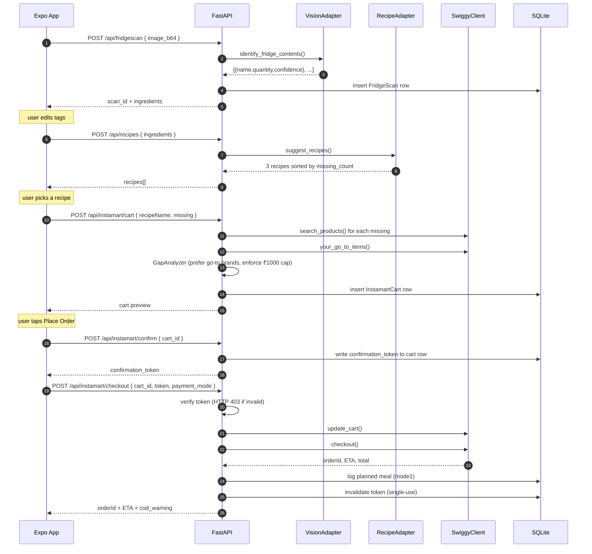
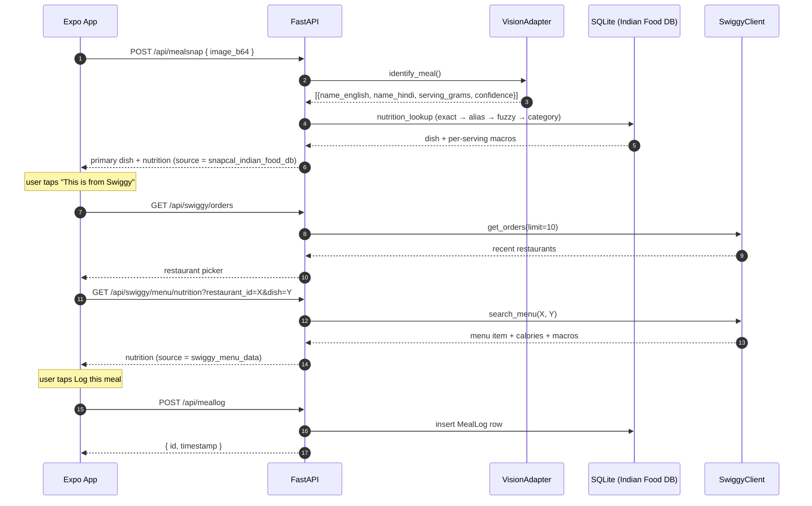

# SnapCal Architecture

Engineering-focused deep-dive. The high-level summary is in the main [README](../README.md); this doc is for anyone (reviewer, future contributor, future-you) who wants the full picture.

---

## System diagram



---

## Repo layout

```
snapcal/
├── backend/
│   ├── app/
│   │   ├── main.py                  ← FastAPI entrypoint + CORS + startup seed
│   │   ├── settings.py              ← pydantic-settings; reads repo-root .env
│   │   ├── api/
│   │   │   ├── health.py            ← /api/health
│   │   │   ├── mealsnap.py          ← /api/mealsnap{,/upload}
│   │   │   ├── fridgescan.py        ← /api/fridgescan + /api/recipes
│   │   │   ├── instamart.py         ← /api/instamart/{cart,confirm,checkout}
│   │   │   ├── swiggy.py            ← /api/swiggy/{orders,menu/nutrition}
│   │   │   ├── dashboard.py         ← /api/onboarding, /meallog, /dashboard/today, /history
│   │   │   └── nutrition.py         ← /api/nutrition/lookup
│   │   ├── services/
│   │   │   ├── nutrition_lookup.py  ← exact → alias → fuzzy → category fallback
│   │   │   ├── meal_snap.py         ← vision → lookup pipeline
│   │   │   ├── gap_analyzer.py      ← missing-ingredients → cart, brand-aware
│   │   │   └── targets.py           ← 3-question → daily calorie/macro targets
│   │   ├── adapters/
│   │   │   ├── vision.py            ← VisionAdapter Protocol + Mock + OpenAI GPT-5.4-mini
│   │   │   ├── recipes.py           ← RecipeAdapter + Mock + Claude Haiku 4.5
│   │   │   └── swiggy.py            ← SwiggyClient + MockSwiggy + SwiggyRealClient stub
│   │   ├── db/
│   │   │   ├── session.py           ← SQLAlchemy engine + sessionmaker
│   │   │   ├── models.py            ← IndianDish, User, MealLog, FridgeScan, InstamartCart
│   │   │   └── seed.py              ← init_db() + Indian food DB seed loader
│   │   └── data/
│   │       └── indian_food_seed.json ← 100 hand-curated Indian dishes
│   └── tests/                       ← pytest — 30 tests, all green
├── app/                             ← Expo (React Native, TypeScript)
│   ├── app/                         ← expo-router pages
│   │   ├── _layout.tsx              ← root stack + onboarding redirect
│   │   ├── (tabs)/
│   │   │   ├── _layout.tsx          ← bottom tabs
│   │   │   ├── index.tsx            ← Snap tab — camera + Fridge/Meal toggle
│   │   │   ├── today.tsx            ← Mode 3 dashboard
│   │   │   └── history.tsx          ← 14-day history
│   │   ├── onboarding.tsx           ← 3-question setup
│   │   ├── result/
│   │   │   ├── meal.tsx             ← Mode 2 result + nutrition card
│   │   │   ├── fridge.tsx           ← Mode 1 ingredient editor
│   │   │   ├── recipes.tsx          ← 3 recipe cards
│   │   │   ├── instamart.tsx        ← Cart + guardrailed checkout
│   │   │   └── order.tsx            ← Order confirmation
│   │   └── swiggy-restaurants.tsx   ← Mode 2 → get_orders → search_menu picker
│   └── src/
│       ├── lib/api.ts               ← axios client + typed wrappers for every backend route
│       ├── lib/theme.ts             ← design tokens (colors, spacing, radius)
│       ├── store/                   ← Zustand: camera mode, session onboarding
│       └── components/              ← Ring, MacroBar, PillTag, Button, PoweredBySwiggy
└── submission/                      ← Phase-11 deliverables
    ├── application-answers.md
    ├── cover-email.md
    └── demo-script.md
```

---

## Mode 1 — FridgeScan call sequence (PRD §8)



## Mode 2 — Meal Snap with Swiggy order detection



---

## Why these design choices

### Three adapters, one interface each

- `VisionAdapter`, `RecipeAdapter`, `SwiggyClient` are Python `Protocol`s.
- For each, we ship a deterministic `Mock*` and a real implementation.
- `get_*_adapter()` factories pick based on `USE_MOCKS` plus the presence of the relevant API key.
- This is why the entire demo runs end-to-end without any external dependency.

### `SwiggyRealClient` is a deliberate stub

It's in the codebase. Every method raises a clear `NotImplementedError("...pending Builders Club credentials...")`. The point: a reviewer reading the source can see exactly where the real MCP calls will land, what env vars unlock them, and what the contract looks like. There's nothing to discover later.

### Three-stage checkout

Stage 1 (`/cart`) builds. Stage 2 (`/confirm`) issues a single-use server-side token in response to an explicit user tap. Stage 3 (`/checkout`) requires that token. The frontend cannot forge the token because it's generated in `confirm_cart` from `secrets.token_urlsafe(24)` and persisted on the cart row before the response is sent.

### SQLite for demo, Supabase for production

Repository pattern (`db/models.py` + the route handlers' DB usage) is plain SQLAlchemy. Swapping to Supabase's Postgres is a `DB_URL` change. The `Supabase*` env vars are in `.env.example` already so future-you doesn't have to think about it.

---

## Test coverage snapshot

`pytest -q` from `backend/` runs **30 tests** covering:

- Health check
- Indian Food DB exact / alias / fuzzy / fallback / payload scaling
- Mode 2 meal-snap pipeline + size limits + Swiggy hint flag
- Mode 1 fridge scan + recipe shape + missing-count ordering
- Gap analyzer brand preferences + unavailability + cart-cap exception
- Three-stage checkout: build → confirm → checkout
- Checkout blocked without token, with forged token, with reused token
- COD warning surfacing
- Onboarding → targets → today dashboard wiring
- Swiggy `get_orders` + `search_menu` cross-reference

All 30 currently green.

---

## Production roadmap (post-Builders-Club)

1. Real `SwiggyRealClient` implementation hitting `https://mcp.swiggy.com/...` once we have credentials.
2. Supabase swap — replace `SessionLocal` with the Supabase Python client behind the same repo interface.
3. Vercel deployment of the FastAPI backend (per PRD §7).
4. EAS Build → Play Store + App Store.
5. Gemini 2.0 Flash routing for cost-optimised Meal Snap calls (PRD §7).
